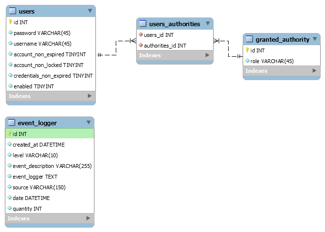

# Central de Erros

## Objetivo

Em projetos modernos é cada vez mais comum o uso de arquiteturas baseadas em serviços ou microsserviços. Nestes ambientes complexos, erros podem surgir em diferentes camadas da aplicação (backend, frontend, mobile, desktop) e mesmo em serviços distintos. Desta forma, é muito importante que os desenvolvedores possam centralizar todos os registros de erros em um local, de onde podem monitorar e tomar decisões mais acertadas. Neste projeto vamos implementar uma API Rest para centralizar registros de erros de aplicações.

Abaixo estão os requisitos desta API, o time terá total liberdade para tomar as decisões técnicas e de arquitetura da API, desde que atendam os requisitos abaixo.

## API

### Tecnologia

- [Java](https://www.oracle.com/technetwork/java/javase/downloads/index.html) ```1.8```
- [Spring Boot](https://spring.io/projects/spring-boot) ```2.2.6.RELEASE```
- [Gradle](https://maven.apache.org/) ```6.3```
- [PostgreSQL](https://www.postgresql.org/) ```10.13``` 
- [HAL-Explorer](https://github.com/toedter/hal-explorer) ```0.12.0```

### Premissas

-   A API deve ser pensada para atender diretamente um front-end
-   Deve ser capaz de gravar os logs de erro em um banco de dados relacional
-   O acesso a ela deve ser permitido apenas por requisições que utilizem um token de acesso válido

### Funcionalidades

-   Deve permitir a autenticação do sistema que deseja utilizar a API gerando o Token de Acesso
-   Pode ser acessado por multiplos sistemas
-   Deve permitir gravar registros de eventos de log salvando informações de  **Level(error, warning, info), Descrição do Evento, LOG do Evento, ORIGEM(Sistema ou Serviço que originou o evento), DATA(Data do evento), QUANTIDADE(Quantidade de Eventos de mesmo tipo)**
-   Deve permitir a listagem dos eventos juntamente com a filtragem de eventos por qualquer parâmetro especificado acima
-   Deve suportar Paginação
-   Deve suportar Ordenação por diferentes tipos de atributos
-   A consulta de listagem  **não deve retornar os LOGs**  dos Eventos
-   Deve permitir a busca de um evento por um ID, dessa maneira exibindo o LOG desse evento em específico

## Instalação

A aplicação foi configurada pra ser executada com o Gradle, portanto será necessário a instalação dessa ferramenta. 

> Instalando o Gradle: [https://gradle.org/install/](https://gradle.org/install/).

### Clonando o repositório:

```bash
$ git clone https://github.com/marcosantoniofilho16/codenation-logger.git
```

### Compilando e empacotando a aplicação

```bash
$ cd codenation-logger
$ ./gradlew build
```

### Testando a aplicação

```bash
$ cd codenation-logger
$ ./gradlew test
```

### Executando a aplicação

```bash
$ cd codenation-logger
$ ./gradlew bootRun
```

> Para testar se a aplicação está em execução, acesse o endereço ```http://localhost:8080/api/```. A resposta deve ser um JSON com os recursos disponíveis na API.

## Endpoints

Após executar a aplicação, você pode acessar a documentação da API, contendo os endpoints implementados, no endereço ```http://localhost:8080/api/explorer/index.html```.

## Diagrama do Banco de Dados



## Deploy

Para fins de demonstração de funcionamento, foi feito o deploy da aplicação nas plataformas [Heroku](https://www.heroku.com/).

| Plataforma | Serviço | Link |
| :--- | :--- | :--- |
| Heroku | Back-end | [https://codenation-logger.herokuapp.com/api](https://codenation-logger.herokuapp.com/api) |
